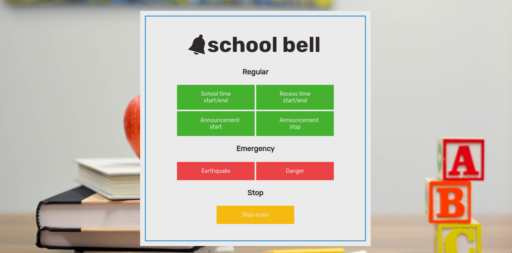

<div align="center">
 
</div>

## Intro
School bell is a remotely-controlled bell through a web interface.
The idea is the device that run this app becomes a web and bell server.
Everytime the button is pressed, the app will executing media player
to play the bell audio files. The app is only tested and working
succesfully on Linux, but other *nix variant that has the requirements
below satisfied might work too.

## Requirements
- Go compiler (>=1.15.6)
- mpv
- pkill

## Installation

```
$ # Clone this repository first
$ git clone github.com/ghifarit53/school-bell`
$
$ # Then cd into the cloned directory
$ cd school-bell
$
$ # Run 'go build' to compile the code
$ go build
$
$ # And a new binary will be created in the directory
$ ls
static  main.go  readme.md  school-bell
$
$ # Run the binary
$ ./school-bell
server started at localhost:8012
$
$ # Then open localhost:8012 on your browser
```

## Configuration
Right now everything is unfortunately hardcoded. If you want to change port,
http route, etc., you will need to change that in the `main.go` file
and recompile again.

If you want to change the UI, e.g. background image, colors, you can just
edit the HTML and CSS files in the `static` folder

## Todo
- [ ] Use Go library to play audio (faiface/beep seems promising)
- [ ] Add authentication
